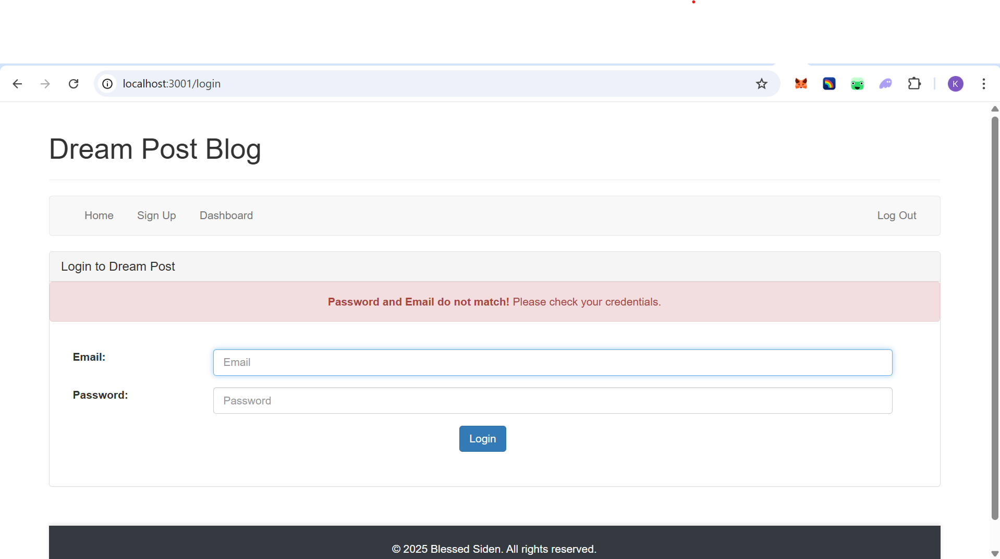
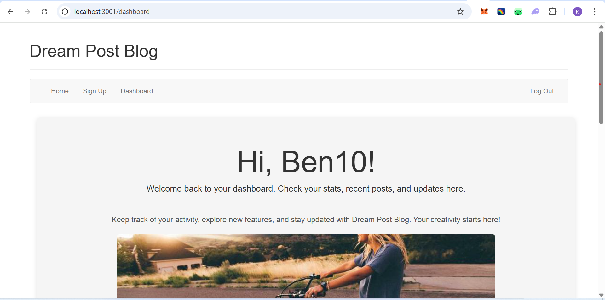

# Dream Post Blog – Node.js & Handlebars

A simple blog dashboard application built with **Node.js**, **Express**, **Sequelize**, **MySQL**, and **Handlebars**. This project allows users to **sign up, log in, and view a personalized dashboard**.

---

## Features

- User authentication with **hashed passwords** using **bcrypt**.
- Session management using **express-session** and cookies.
- Flash messages for error/success notifications.
- Responsive UI with **Bootstrap 3**.
- Handlebars templating engine for dynamic HTML rendering.
- Dashboard with personalized greeting.
- Footer and navigation bar included in layout.

---

## Prerequisites

- Node.js & npm installed on your system.
- **XAMPP** or **MySQL** running locally.
- A code editor (VS Code recommended).

---

## 📸 Screenshots

**Login Page**  



**Dashboard Page**  


## Step 1: Clone the Repository

```bash
git clone https://github.com/BlessedSiden1234/dream-post-blog.git
cd handlebars
```

---

## Step 2: Install Dependencies

```bash
npm install
```

This will install all required packages like Express, Sequelize, MySQL2, bcrypt, etc.

---

## Step 3: Create MySQL Database

You need to create a MySQL database for this project. You can do it via **phpMyAdmin** (XAMPP) or MySQL CLI.

**Database Name:** `form`  

**Steps (XAMPP / phpMyAdmin):**  

1. Open XAMPP and start **Apache** and **MySQL**.  
2. Go to `http://localhost/phpmyadmin`.  
3. Click **Databases**, enter `form` as the database name, and click **Create**.  

> The database `form` will store user information.

---

## Step 4: Models – `userSchema.js`

This file defines the `User` table and handles password hashing.  

```javascript

const sequelize = new Sequelize('<DATABASE_NAME>', '<DB_USER>', '<DB_PASSWORD>', {
    host: '<DB_HOST>',
    port: 3306,
    dialect: 'mysql',
    pool: {
        max: 5,
        min: 0,
        acquire: 30000,
        idle: 10000
    }, 
    operatorsAliases: false
});

```

---

## Step 5: Start the Application

- For development (with auto-restart):

```bash
npm run dev
```

- For production:

```bash
npm start
```

The server will start at `http://localhost:3001`.  
Open your browser and go to:

```
http://localhost:3001/login
```

> Sign up for a new account and access the dashboard.

---

## Step 6: Folder Structure

```
handlebars/
│
├── controllers/
│   ├── index.js
│   └── api/
│       ├── index.js
│       └── login-routes.js
│
├── models/
│   └── userSchema.js
│
├── views/
│   ├── layouts/
│   │   └── main.hbs
│   ├── login.hbs
│   ├── signup.hbs
│   └── index.hbs
│
├── index.js
├── package.json
└── README.md
```

---

## Step 7: Notes

- Ensure MySQL is running and database `form` or any db name you create exists before starting the server.
- Passwords are hashed using bcrypt; they are never stored in plain text.
- Flash messages show login/signup errors on the UI.
- You can customize `views/layouts/main.hbs` for styling and content.
